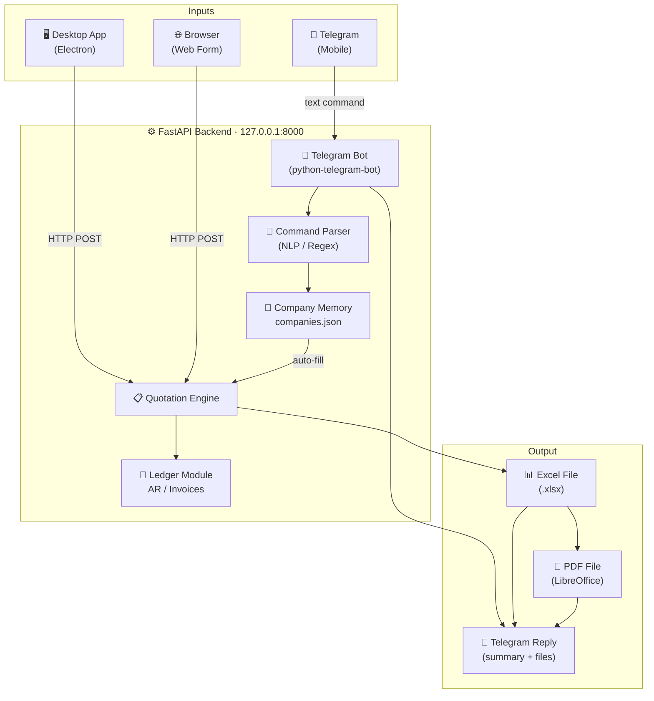

<div align="center">

# 🏢 OfficePilot AI

**Local Windows automation for professional quotation generation, company memory, AR ledger, and Telegram bot integration.**

[](https://python.org)
[](https://fastapi.tiangolo.com)
[](https://electronjs.org)
[](https://core.telegram.org/bots)
[](https://openpyxl.readthedocs.io)
[](https://huggingface.co/spaces)
[](https://www.microsoft.com/windows)
[](LICENSE)

</div>

---

## 🎯 What Is This?

OfficePilot AI is a **self-hosted, Windows-first business automation tool** that replaces manual quotation workflows with a smart backend + desktop app.

- Type a quotation command on your phone via **Telegram** — get an Excel + PDF back in seconds
- Use the **desktop app** (Electron) for full form-based quotation creation
- **Company memory** auto-fills ATTN, TRN, phone, and fax for known clients
- **Ledger module** tracks invoices, payments, and outstanding balances
- All data stays **100% local** — no cloud, no subscriptions

---

## 🗺️ Architecture



---

## ✨ Features

### 📋 Quotation Generation
- Sequential reference number detection (scans existing files)
- Fill Excel template with client details, items, totals
- Multi-item quotations with auto-calculated subtotal + 5% VAT
- Windows-safe filenames: `18-04-2026 ref# 2705 GULF EXTRUSION.xlsx`
- Auto PDF export via LibreOffice headless

### 🧠 Natural Language Quick Command
Send plain English — get a quotation:
```
Create quotation for GULF EXTRUSION COMPANY LLC
Item 1 FABRICATION OF SS ROLLER qty 1 rate 500
Item 2 TEFLON ROUND BAR qty 2 rate 350
```

### 🏢 Company Memory
- Stores company name, ATTN, TRN, phone, fax, payment terms
- Fuzzy matching — partial names work
- Auto-fills form fields when a known company is typed
- Pre-loaded with sample companies (edit `data/companies.json`)

### 📱 Telegram Bot
- Send quotation commands from your mobile
- Bot replies with: client, ref number, total amount
- Sends both Excel and PDF files back via `sendDocument`
- Only your configured chat ID can use it
- Auto-starts with the backend

### 📒 Customer Ledger / AR Module
- Invoice entry with auto due-date calculation
- Payment recording with payment mode tracking
- Status tracking: `UNPAID` / `PARTIALLY PAID` / `PAID` / `OVERDUE`
- Company-wise collapsible ledger view
- KPI cards: Total Invoiced, Received, Outstanding

### 🖥️ Desktop App
- Electron-based portable `.exe` — no install required
- Auto-starts Python backend on launch
- Dark-themed modern UI
- Full quotation form, Quick Command mode, Company Manager, Ledger tab

---

## 🚀 Quick Start

### Prerequisites
- **Python 3.11+** — [python.org/downloads](https://www.python.org/downloads/)
- **Node.js 18+** (only for rebuilding the desktop app)
- **LibreOffice** (optional, for PDF export) — [libreoffice.org](https://www.libreoffice.org/download/)

### 1. Clone & install

```bash
git clone https://github.com/zohair-azmat-ai/officepilot-ai.git
cd officepilot-ai
python -m venv venv
venv\Scripts\activate          # Windows
pip install -r requirements.txt
```

### 2. Configure

```bash
cp .env.example .env
```

Edit `.env`:
```env
QUOTATION_BASE_PATH=G:\YOUR\QUOTATION\FOLDER
TEMPLATE_PATH=templates\quotation_template.xlsx
APP_HOST=127.0.0.1
APP_PORT=8000
```

### 3. Generate Excel template (first time only)

```bash
python create_template.py
```

### 4. Run the backend

```bash
python run.py
```

Open **http://127.0.0.1:8000** in your browser.  
API docs: **http://127.0.0.1:8000/docs**

---

## 📱 Telegram Bot Setup

1. **Create your bot** — message [@BotFather](https://t.me/BotFather) on Telegram → `/newbot` → copy the token

2. **Get your chat ID** — message [@userinfobot](https://t.me/userinfobot) → copy the number

3. **Add to `.env`**:
```env
TELEGRAM_ENABLED=true
TELEGRAM_BOT_TOKEN=your_token_here
TELEGRAM_ALLOWED_CHAT_IDS=your_chat_id_here
```

4. **Restart the backend** — the bot starts automatically.

### Sending commands

Single item:
```
Quote for ABB INDUSTRIES fabrication of hydraulic block qty 1 rate 950
```

Multi-item:
```
Create quotation for GULF EXTRUSION COMPANY LLC
Item 1 FABRICATION OF SS ROLLER qty 1 rate 500
Item 2 TEFLON ROUND BAR qty 2 rate 350
```

Bot replies with a summary message + sends both the Excel and PDF files.

---

## 🖥️ Desktop App

The portable Electron app auto-starts the Python backend when launched.

**Build from source:**
```bash
cd desktop-app
npm install
npm run build:portable
```

Output: `desktop-app/dist/OfficePilot-AI-1.0.0-portable.exe`

---

## 🏗️ Project Structure

```
officepilot-ai/
├── app/
│   ├── main.py                     # FastAPI app + lifespan (bot start/stop)
│   ├── config.py                   # All settings, cell map, Telegram config
│   ├── api/
│   │   ├── quotation.py            # POST /quotations/create, parse-command
│   │   ├── companies.py            # GET/POST /companies (memory CRUD)
│   │   └── ledger.py               # Invoices + payments + overview endpoints
│   ├── schemas/
│   │   ├── quotation.py            # QuotationCreateRequest/Response
│   │   ├── command.py              # ParseCommandRequest/Response
│   │   ├── company.py              # CompanyRecord
│   │   └── ledger.py               # Invoice, Payment, LedgerOverview
│   └── services/
│       ├── command_parser.py       # NLP regex parser (no LLM)
│       ├── company_memory.py       # Fuzzy lookup + JSON persistence
│       ├── quotation_service.py    # Orchestrator
│       ├── excel_writer.py         # openpyxl template filler
│       ├── file_naming.py          # Windows-safe filename builder
│       ├── ref_parser.py           # Folder scanner for next ref number
│       ├── pdf_export.py           # LibreOffice headless conversion
│       ├── ledger_service.py       # AR CRUD + balance computation
│       ├── telegram_bot.py         # Bot lifecycle (start/stop)
│       ├── telegram_handlers.py    # Message routing + quotation handler
│       └── telegram_sender.py      # send_text / send_document helpers
├── desktop-app/
│   ├── main.js                     # Electron main (backend auto-start)
│   ├── preload.js
│   ├── renderer/
│   │   ├── index.html              # Full SPA: Quotation, Ledger, Companies
│   │   ├── app.js                  # All frontend logic
│   │   └── style.css               # Dark theme styles
│   └── package.json
├── data/
│   ├── companies.json              # Pre-loaded company memory
│   ├── invoices.json               # AR invoices (starts empty)
│   └── payments.json               # AR payments (starts empty)
├── templates/
│   └── quotation_template.xlsx     # Excel template (your format)
├── static/
│   └── index.html                  # Web frontend (served by FastAPI)
├── Dockerfile                      # Hugging Face Spaces / Docker deploy
├── run.py                          # Dev launcher (with reload)
├── run_prod.py                     # Production launcher (no reload)
├── requirements.txt
├── .env.example                    # Config template (copy → .env)
└── create_template.py              # One-time template generator
```

---

## 📊 API Reference

| Method | Endpoint | Description |
|--------|----------|-------------|
| `POST` | `/quotations/create` | Create quotation from structured data |
| `POST` | `/quotations/parse-command` | Parse natural-language command |
| `GET`  | `/quotations/health` | Liveness check |
| `GET`  | `/companies` | List all saved companies |
| `GET`  | `/companies/lookup?q=` | Fuzzy company search |
| `POST` | `/companies` | Upsert company record |
| `POST` | `/ledger/invoices` | Create invoice |
| `GET`  | `/ledger/invoices` | List all invoices |
| `DELETE` | `/ledger/invoices/{id}` | Delete invoice |
| `POST` | `/ledger/payments` | Record payment |
| `GET`  | `/ledger/overview` | Full AR ledger with computed balances |
| `GET`  | `/ledger/company/{name}` | Company-specific ledger |

Full interactive docs: **http://127.0.0.1:8000/docs**

---

## 🐳 Deploy to Hugging Face Spaces

1. Fork this repository
2. Create a new **Docker Space** on [huggingface.co/spaces](https://huggingface.co/spaces)
3. Connect your fork
4. Add Space secrets:
   ```
   QUOTATION_BASE_PATH=/app/output
   TELEGRAM_ENABLED=true
   TELEGRAM_BOT_TOKEN=your_token
   TELEGRAM_ALLOWED_CHAT_IDS=your_chat_id
   ```
5. The Space will build from the `Dockerfile` and expose the API on port 7860

> **Note:** The Telegram bot runs fully in the container. Excel/PDF files are saved to `/app/output` inside the Space.

---

## 🪟 Windows Auto-Start

To start the backend automatically at Windows login (no terminal needed):

1. Edit `start_backend.vbs` with your actual Python and project paths
2. Copy it to your Windows Startup folder:
   ```
   %APPDATA%\Microsoft\Windows\Start Menu\Programs\Startup\
   ```
3. The backend (and Telegram bot) will start silently at every login

---

## 📸 Screenshots

| Desktop App | Telegram Bot | Ledger View |
|-------------|-------------|-------------|
| *(screenshot placeholder)* | *(screenshot placeholder)* | *(screenshot placeholder)* |

---

## 📦 Requirements

```
fastapi>=0.115.0
uvicorn[standard]>=0.30.0
openpyxl>=3.1.2
pydantic>=2.11.0
pydantic-settings>=2.5.0
python-dotenv>=1.0.1
python-multipart>=0.0.9
python-telegram-bot>=20.0
```

---

## 📄 License

MIT — free to use, modify, and distribute.

---

<div align="center">
Built with ❤️ for real office automation — no cloud required.
</div>
